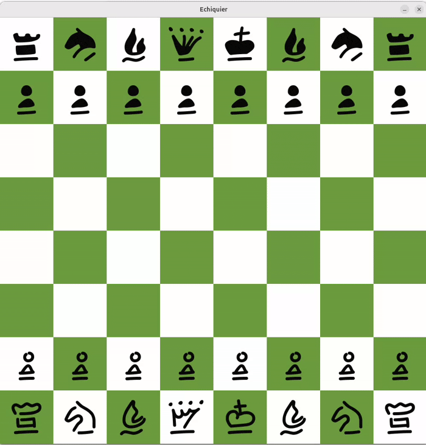
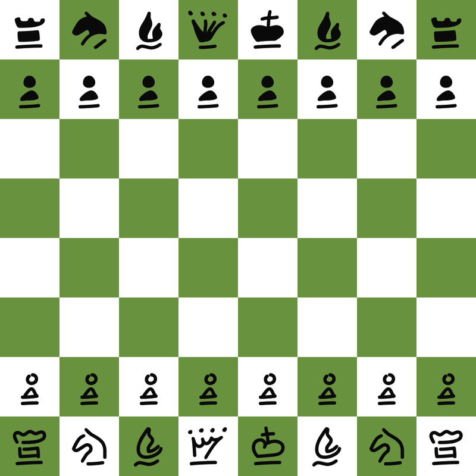

# ♟️ Pygame Chess Engine (pychess-engine-TIPE)

A custom Python chess engine exploring tree-search optimization techniques, developed for my CPGE final exam (TIPE).

**Highlights** : 
* **Algorithmic progression** : 6 engine variants implementing Minimax, Alpha-Beta Pruning, Quiescence Search, Transposition Tables (Memoization), and dedicated Endgame evaluation.
* **Rigorous benchmarking** : Evaluated across 700+ simulated games using Bayeselo against a physical hardware anchor (*LexiBook ChessMan FX CG1335*).
* **Performance** : Peak version achieved **~2100 Elo**.

---

## 📌 Concept Overview

I built this project to explore how search tree optimizations and evaluation heuristics improve chess engine performance step-by-step. Built as part of a CPGE TIPE project, it documents the progressive performance gains achieved by transitioning from simple naive evaluation to Minimax with Alpha-Beta Pruning, Quiescence Search, and Transposition Tables.

* **Interactive Interface** : Play directly against different engine implementations using a clean Pygame board.
* **PGN Export** : Automatically generates standard PGN game logs at the end of every match.
* **Asynchronous Calculation** : Bot thinking occurs on a dedicated worker thread, keeping the GUI responsive at 30 FPS.

---

## 🛠️ Libraries & Dependencies

| Resource / Library | Usage                                                                     |
| :----------------- | :------------------------------------------------------------------------ |
| `python-chess`     | Handles board representation, move generation, and legal move validation. |
| `pygame`           | Renders the graphical interface, user interactions, and board visuals.    |
| `threading`        | Runs engine search algorithms in the background to prevent GUI freezing.  |
| `Pecita Font` | Custom TTF font used for rendering hand-drawn style chess symbols. |

---

## 📖 Lichess Opening Book Integration

Instead of computing moves from scratch in early turns, the bot uses a custom opening book (`dico_ouvertures.py`) extracted from Lichess data. Matching positions returns instant moves, saving CPU time for critical midgame positions.

* **Data Source** : Derived from the official [`lichess-org/chess-openings`](https://github.com/lichess-org/chess-openings) database, which aggregates thousands of standard opening lines.
* **Implementation** : The raw TSV dataset was parsed and converted into a Python dictionary.
* **Performance** : If the current board position matches a known opening line, the move is played instantly (0 nodes evaluated), reserving full CPU power for complex midgame positions.

  

---

## 🧵 Real-Time Calculation & Multithreading

Deep Minimax calculations with Alpha-Beta pruning can be computationally expensive. By delegating the search functions to a secondary `threading.Thread`, the Pygame loop continues drawing at 30 FPS without stuttering.

This setup allows players to see the board react smoothly while the bot evaluates variations in the background. It provides a real-time visualization of the engine's decision-making process ! 

  

*(Fun fact : after Bishop to d7, Black has a 0.15 lead according to Stockfish)*

---

## 📊 Bot Implementations & Estimated Elo

Below is a comparison of the different engine levels implemented in the project.
Ratings were statistically calculated using **Bayeselo** based on a benchmark of over 700 matches (`main_bot_vs_bot.py` and `main_tournoi.py`).

| Bot Version                     | Depth | Main Upgrade / Technique                     | Estimated Elo |
| :------------------------------ | :---: | :------------------------------------------- | :-----------: |
| **Naive**                       |   1   | Random capture heuristics                    |      678      |
| **Minimax**                     |   3   | Basic Minimax search                         |     1437      |
| **Alpha-Beta**                  |   4   | + Alpha-Beta Pruning                         |     1698      |
| **LexiBook ChessMan FX CG1335** |  N/A  | *External Hardware Reference (Anchor)*       |     1800      |
| **Quiescence Search**           |   4   | + Quiescence Search (tactical stability)     |     1937      |
| **Memoization**                 |   5   | + Transposition Tables & Piece-Square Tables |     1967      |
| **Endgame Engine**              |   5   | + Dedicated Endgame Evaluation               |     2065      |

---

## 👤 Author

* [@antoine-pz](https://github.com/antoine-pz) 

---

## Acknowledgements

* [Claude E. Shannon : Programming a Computer for Playing Chess](https://www.computerhistory.org/chess/doc-431614f453dde/)
* [Mark Lefler : ChessProgrammingWiki](https://www.chessprogramming.org/)
* [Bruce Moreland : Computer chess topics](https://web.archive.org/web/20071026090003/http://www.brucemo.com/compchess/programming/index.htm)
* [Lichess : chess-openings](https://github.com/lichess-org/chess-openings)
* [Tomasz Michniewski : Simplified Evaluation Function](https://www.chessprogramming.org/Simplified_Evaluation_Function)
* [Rémi Coulom : Bayeselo](https://www.remi-coulom.fr/Bayesian-Elo/)

---

## License

This project is licensed under the [MIT License](https://choosealicense.com/licenses/mit/).
Licensed under the MIT License.
See the `LICENSE` file for details.

---

## Feedback

If you have any feedback, please reach out at baruchdesailly@gmail.com
